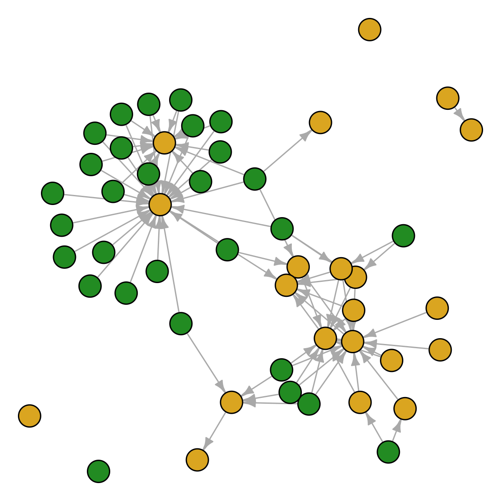
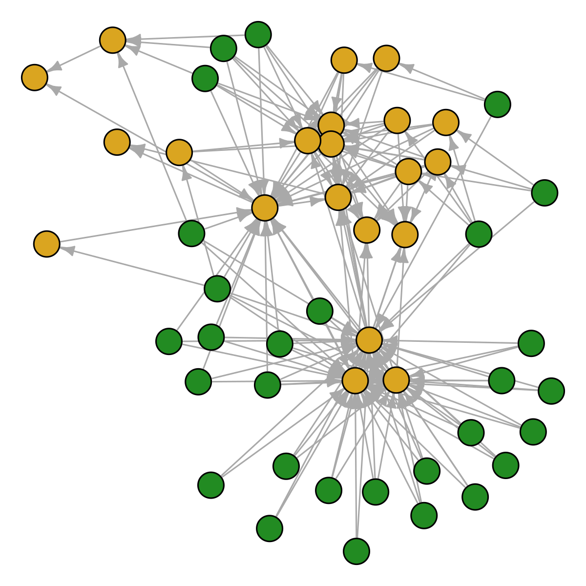

<!-- badges: start -->

[](https://github.com/emilio-berti/assembly/actions)
<!-- badges: end -->

<!-- README.md is generated from README.Rmd. Please edit that file -->

# Example workflow

Following food web terminology, I talk here about *resources* and
*consumers*. In the case of plant-pollinator networks, this is analogous
as replacing *resource* with *plant* and *consumers* with *pollinator*.
In this case, however, some filtering steps may be unnecessary and
unwanted. **More about this in a separate section.**

I show an example workflow that is composed of the following steps:

1.  draw random species from a metaweb
2.  impose resource filtering, i.e. each basal species must be consumed
    and each consumer must feed on a resource.
3.  impose limiting similarity filtering, i.e. consumers are constantly
    replaced by others following a probability distribution proportional
    to their similarity of interactions.

## Draw random species from a metaweb

Loading the required libraries and set a random seed:

``` r
library(assembly)
#> Loading required package: igraph
#> 
#> Attaching package: 'igraph'
#> The following objects are masked from 'package:stats':
#> 
#>     decompose, spectrum
#> The following object is masked from 'package:base':
#> 
#>     union
library(igraph)

set.seed(1234)
```

Load the dataset *adirondack* that comes with *assembly*:

``` r
data(adirondack)
```

*adirondack* is the Adirondack Lakes metaweb as obtained from the
GATEWAy database.

Define the number of species for the local community:

``` r
S <- 50 #species richness
```

To draw a random community, use the function `draw_random_species()`:

``` r
sp <- draw_random_species(S, colnames(adirondack))
sum(colSums(adirondack[sp, sp]) == 0)
#> [1] 20
show_graph(sp, adirondack)
```



## Hidden functions

There are several hidden functions in *assembly*. The reason there are
hidden functions is because there is no need to call them directly.
Hidden functions can be accessed by prefixing the `assembly:::` (three
colon, not two). All hidden functions start with a dot `.`,
e.g. `assembly:::.basals()`.

In general, you should not be bothered by hidden functions and should
not call them directly, unless you have a good understanding of how they
operate. Nevertheless, I summarize them for clarity.

`assembly:::.basals()` get all basal species in the metaweb, and is
equivalent to subset the names of the metaweb where
`colSums(metaweb) == 0`:

``` r
identical(
  sort(intersect(assembly:::.basals(adirondack), sp)),
  sort(intersect(colnames(adirondack)[colSums(adirondack) == 0], sp))
)
#> [1] TRUE
```

`assembly:::.consumers()` and `assembly:::.top()` return the consumers
and top consumers of the metaweb, respectively.

`assembly:::.find_isolated()` returns the species that are isolated in
the local community:

``` r
assembly:::.find_isolated(sp, adirondack)
#> [1] "Nephrocytium sp."      "Alona rectangula"      "Scenedesmus dimorphus"
#> [4] "Coelosphaerium sp."    "Scenedesmus serratus"  "Kirchneriella lunaris"
```

`assembly:::.find_replacements()` find suitable replacement for the
isolated species:

``` r
assembly:::.find_replacements(sp,
                              assembly:::.find_isolated(sp, adirondack),
                              adirondack,
                              keep.n.basal = TRUE)
#> [1] "Osmerus mordax"     "Cosmarium sp."      "Staurastrum sp."   
#> [4] "Desmidium sp."      "Anabaena sp."       "Xanthidium armatum"
```

If *keep.n.basal* is TRUE (default = FALSE), then the original number of
basal species will not change.

`assembly:::.move()` performs a move in the limiting similarity
procedure (more about this later):

``` r
tryCatch(assembly:::.move(sp, adirondack, t = 1),
         error = function(e) print(e))
#> <simpleError in assembly:::.move(sp, adirondack, t = 1): Isolated species detected in input>
```

This call to `assembly:::.move()` fails because isolated species are
detected in the input. This is a desired property of the function,
i.e. it fails when there is an unexpected behavior. All hidden functions
have some kind of behavior-check, which is a safety net to assure the
code is doing what you asked for.

Finally, `assembly:::.components()` returns the number of connected
components in the graph of the local community:

``` r
assembly:::.components(sp, adirondack)
#> [1] 6
```

Usually, a proper food web has only one component, i.e. all species are
connected by a path. Having more than one component means that the food
web is actually made of several disconnected communities. In the case
above, it also means that at least one of this disconnected communities
is composed of only one isolated species.

# Resouce filtering

To impose the resource filtering, I call the function
`resource_filtering()`. This takes as input the species names, the
metaweb, and an optional argument *keep.n.basal* to specify weather the
original number of basal species should be kept constant (default =
`FALSE`). **NOTE this may not be implemented correctly**

Behind the curtain, `resource_filtering()` calls the hidden functions as
a way to compress code and make it consistent. That’s why you shouldn’t
bother too much about hidden functions: they’re there because they’re
useful in the development of the package, rather than for your usage. If
they’re useful for you and you understand how they work, use them.

``` r
sp_resource <- resource_filtering(sp, adirondack, keep.n.basal = TRUE)
show_fw(sp_resource, adirondack, title = "Resource filtering")
```


``` r
show_graph(sp_resource, adirondack)
```


Now the local community is fully connected, i.e. basal species always
have a consumer and consumers always have an available resource. It’s
possible to check this manually calling the hidden functions and working
on the adjacency matrix of the local community:

``` r
bas <- intersect(sp_resource, assembly:::.basals(adirondack))
cons <- intersect(sp_resource, assembly:::.consumers(adirondack))
all(rowSums(adirondack[bas, cons]) > 0)
#> [1] TRUE
all(colSums(adirondack[union(bas, cons), cons]) > 0)
#> [1] TRUE
```

Usually you don’t need to perform these checks, as I implemented them
within `resource_filtering()`. I also implemented a check for
disconnected components, to make sure that the resulting community has
no isolated species and only one actual community.

Bonus: because of these checks, now it is safe to perform a move of the
limiting similarity procedure:

``` r
assembly:::.move(sp_resource, adirondack, t = 1)
#>  [1] "Chydorus bicornutus"        "Diaptomus sicilis"         
#>  [3] "Lepomis gibbosus"           "Colletheca mutabilis"      
#>  [5] "Xanthidium sp."             "Diceras sp."               
#>  [7] "Trichotria tetractis"       "Conochiloides dossuarius"  
#>  [9] "Kelicottia longispina"      "Aphanothece sp."           
#> [11] "Ankistrodesmus sp."         "Daphnia pulex"             
#> [13] "Keratella cochlearis"       "Crucigenia rectangularis"  
#> [15] "Coregonus clupeaformis"     "Melosira sp."              
#> [17] "Cryptomonas ovata"          "Chrosomus eos"             
#> [19] "Eucyclops agilis"           "Ascomorpha ecaudis"        
#> [21] "Rhinichthys atratulus"      "Trichocerca pusilla"       
#> [23] "Lecane mira"                "Nitzschia sp."             
#> [25] "Sida crystallina"           "Rhizosolenia eriensis"     
#> [27] "Diaphanosoma birgei"        "Dictyosphaerium pulchellum"
#> [29] "nanoflagellates "           "Conochiloides unicornis"   
#> [31] "Polyarthra euryptera"       "Merismopedia tenuissima"   
#> [33] "Cyclops scutifer"           "Lecane sp."                
#> [35] "Notemigonus crysoleucas"    "fish eggs"                 
#> [37] "Keratella testudo"          "Lepadella cristata"        
#> [39] "Keratella taurocephala"     "Trichocerca cylindrica"    
#> [41] "fish fry"                   "Diaptomus leptopus"        
#> [43] "Scenedesmus arcuatus"       "Kelicottia bostoniensis"   
#> [45] "benthic detritus"           "Xanthidium armatum"        
#> [47] "Gomphonema sp."             "Peridinium wisconsinense"  
#> [49] "Arthrodesmus incus"         "Mesocyclops edax"
```

# Limiting similarity filtering

The limiting similarity filtering is composed of a series of individuals
moves:

1.  A metric
    ()
    representing the similarity of interaction is calculated for each
    species in the community.
2.  One species is removed with probability proportional to their
    .
3.  The species removed is replaced by another species selected at
    random from the metaweb.

Each move can then be accepted of discarded based on a probabilistic
acceptance criterion, the Metropolis-Hasting algorithm (see below for
details). If the move is accepted, the new community will differ from
the starting one only in the removed/replaced species. If the move is
discarded, the new community is identical to the starting one. Each move
takes as input the community of the previous move (or the initial
community for the first move) and returns as output the new community
(or the original one).

The limiting similarity procedure is simply a series of moves (accepted
or not). The starting community for the limiting similarity procedure is
usually a community that has undergone already a resource filtering,
imposing thus that trophic competition comes after resource
availability. However, it is possible to skip the resource filtering
step; the only requirement of the starting community for the limiting
similarity filtering is that it does not have isolated species and has
only one connected components.

To impose the limiting similariy filtering, call the function
`similarity_filtering()`. This function has the argument *t*, which is
the temperature of the Metropolis-Hastings algorithm, and *max.iter*
(default = 1,000), which is the maximum number of moves allowed.

``` r
sp_sim <- similarity_filtering(sp_resource, adirondack, t = 1)
show_graph(sp_sim, adirondack)
```



## Metropolis-Hasting algorithm

To accept a move, it must pass a Metropolis-Hasting algorithm. If the
similarity of the new community is lower than the similarity of the old
one, the move is always accepted. When the new similarity is higher than
the old similarity, the move is accepted if:

 \frac{1}{t}} > \mathcal{U}(0, 1)
")

This means that, even when the new similarity is higher than the old one
and the new community has species with increased similarity of
interaction, it can still be accepted as a valid move based on a
probability density function. The probability of acceptance depends on
how much the new similarity is higher than the old one and by the
temperature parameter *t*. For increasing *t*, it is more likely to
accept a non-favorable move:

``` r
temp <- 10 ^ seq(-2, 1, by = .1)
ratio <- 10 ^ seq(-1, 2, by = .1)

move <- rep(NA, length(temp) * length(ratio))
i <- 1
for (t in temp){
  for (x in ratio) {
    move[i] <- metropolis.hastings(1, x, t)
    i <- i + 1
  }
}

d <- data.frame(Temp = rep(temp, each = length(ratio)),
                Ratio = rep(ratio, length(temp)),
                Move = as.numeric(move))
cols <- colorRampPalette(c("steelblue", "tomato"))
cols <- cols(length(unique(d$Temp)))
pal <- adjustcolor(cols, alpha.f = .2)
pal <- pal[sapply(d$Temp, \(x) which(unique(d$Temp) == x))]
plot(log10(d$Ratio), jitter(d$Move, factor = .2), 
     xlab = "Similiarity ratio (new / old)",
     ylab = "Accepted move",
     col = pal, pch = 20, frame = FALSE)
for (t in unique(d$Temp)) {
  x <- log10(d$Ratio[d$Temp == t])
  y <- d$Move[d$Temp == t]
  fit <- loess(y ~ x)
  lines(fit$x, fit$fitted, col = cols[which(unique(d$Temp) == t)])
}
legend(-1, .7, legend = seq(-2, 1, by = .5), 
       fill = colorRampPalette(c("steelblue", "tomato"))(7),
       title = "log10(t)")
```


The reason to include this algorithm is to avoid a purely deterministic
procedure and include some stochasticity in the process. However, if
this is unwanted, it can be removed (and the process made purely
deterministic), by specifying a very high temperature parameter *t*:

``` r
table(sapply(seq_len(1000), \(x) metropolis.hastings(1, 1e3, t = 1e9)))
#> 
#> TRUE 
#> 1000
```

## Example 1: Trophic levels in random and filtered communities

For 50 local communities I:

1.  draw random species
2.  apply the resource filtering procedure
3.  calculate the trophic level of the species in the local communities
4.  I calculate average and maximum trophic levels within each community

``` r
# TL_random <- matrix(NA, S, 50)
# TL_resource <- matrix(NA, S, 50)
# for (i in seq_len(50)) {
#   sp <- draw_random_species(S, colnames(adirondack))
#   sp_resource <- resource_filtering(sp, adirondack, keep.n.basal = TRUE)
#   TL_random[, i] <- ATNr::TroLev(adirondack[sp, sp])[, 1]
#   TL_resource[, i] <- ATNr::TroLev(adirondack[sp_resource, sp_resource])[, 1]
# }
# plot(colMeans(TL_random), colMeans(TL_resource),
#      xlim = c(1.1, 2.2), ylim = c(1.1, 2.2),
#      main = "Average trophic level",
#      xlab = "Random communities",
#      ylab = "Resource filtered communities")
# abline(0, 1)
# plot(apply(TL_random, 2, max), apply(TL_resource, 2, max),
#      xlim = c(2.2, 9.2), ylim = c(2.2, 9.2),
#      main = "Maximum trophic level",
#      xlab = "Random communities",
#      ylab = "Resource filtered communities")
# abline(0, 1)
```

Trophic level tend to be higher in resource-filtered communities
compared to random communities. This is due to isolated consumers
(trophic level = 1) in the random communities and that were replaced by
connected consumers when imposing resource filtering. It’s also evident
when computing the number of connected components:

``` r
show_fw(sp, adirondack)
```


``` r
assembly:::.components(sp, adirondack)
#> [1] 6

show_fw(sp_resource, adirondack)
```


``` r
assembly:::.components(sp_resource, adirondack)
#> [1] 1
```
