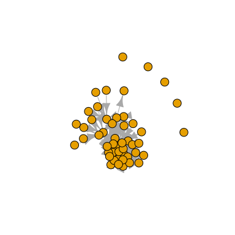
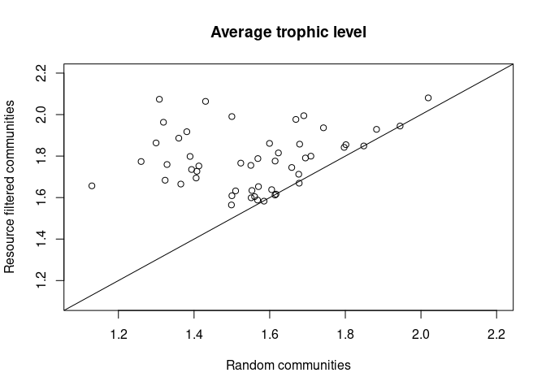
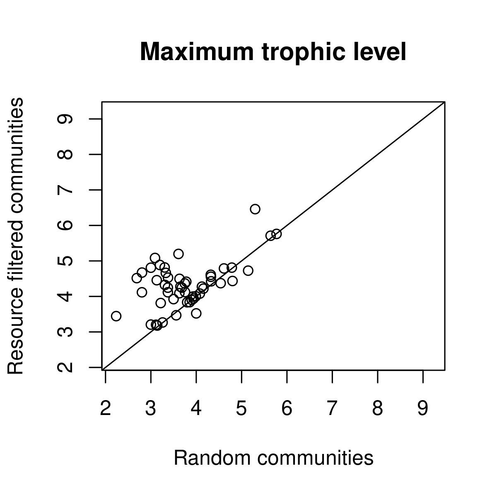

<!-- badges: start -->

[](https://github.com/emilio-berti/assembly/actions)
<!-- badges: end -->

<!-- README.md is generated from README.Rmd. Please edit that file -->

# Example workflow

Following food web terminology, I talk here about *resources* and
*consumers*. In the case of plant-pollinator networks, this is analogous
as replacing *resource* with *plant* and *consumers* with *pollinator*.
In this case, however, some filtering steps may be unnecessary and
unwanted. **More about this in a separate section.**

I show an example workflow that is composed of the following steps:

1.  draw random species from a metaweb
2.  impose resource filtering, i.e. each basal species must be consumed
    and each consumer must feed on a resource.
3.  impose limiting similarity filtering, i.e. consumers are constantly
    replaced by others following a probability distribution proportional
    to their similarity of interactions.

## Draw random species from a metaweb

``` r
library(assembly)
library(igraph)
#> 
#> Attaching package: 'igraph'
#> The following objects are masked from 'package:stats':
#> 
#>     decompose, spectrum
#> The following object is masked from 'package:base':
#> 
#>     union

set.seed(1234)

# load Adirondack dataset
# this is part of the assembly package
data(adirondack) 

S <- 50 #species richness
sp <- draw_random_species(S, colnames(adirondack)) #draw 50 random species
sum(colSums(adirondack[sp, sp]) == 0) #20 basal species
#> [1] 20
show_fw(sp, adirondack, title = "Random")
```


``` r
plot(graph_from_adjacency_matrix(adirondack[sp, sp]), vertex.label = NA)
```



You can see that some species are isolated, i.e. they do not interact
with any other species in the local community. You can find isolated
species with the hidden function `assembly:::.find_isolated()`.

``` r
assembly:::.find_isolated(sp, adirondack)
#> [1] "Nephrocytium sp."      "Alona rectangula"      "Scenedesmus dimorphus"
#> [4] "Coelosphaerium sp."    "Scenedesmus serratus"  "Kirchneriella lunaris"
```

Similarly, it’s possible to obtain the number of weakly connected
components of the graph of the local community:

``` r
assembly:::.components(sp, adirondack)
#> [1] 6
```

The reason there are hidden functions in *assembly* is because there is
no need to call them directly. Hidden functions can be accessed by
prefixing the `assembly:::` (three colon, not two).

To impose the resource filtering, I call the function
`resource_filtering()`. This takes as input the species names, the
metaweb, and an optional argument *keep.n.basal* to specify weather the
original number of basal species should be kept constant (default =
`FALSE`). **NOTE this still not implemented correctly**\*

``` r
sp_resource <- resource_filtering(sp, adirondack, keep.n.basal = TRUE)
show_fw(sp_resource, adirondack, title = "Resource filtering")
```


``` r
plot(graph_from_adjacency_matrix(adirondack[sp_resource, sp_resource]), vertex.label = NA)
```


Now the local community is fully connected, i.e. basal species always
have a consumer and consumers always have an available resource. It’s
possible to check this manually calling other hidden functions and
working on the adjacency matrix of the local community:

``` r
bas <- intersect(sp_resource, assembly:::.basals(adirondack))
cons <- intersect(sp_resource, assembly:::.consumers(adirondack))
all(rowSums(adirondack[bas, cons]) > 0)
#> [1] TRUE
all(colSums(adirondack[union(bas, cons), cons]) > 0)
#> [1] TRUE
```

In general, there is no need to check this, as if this is not the case
`resource_filtering()` will fail: **put example here.**

``` r
# nothing for now
```

## Example 1: Trophic levels in random and filtered communities

For 50 local communities I:

1.  draw random species
2.  apply the resource filtering procedure
3.  calculate the trophic level of the species in the local communities
4.  I calculate average and maximum trophic levels within each community

``` r
TL_random <- matrix(NA, S, 50)
TL_resource <- matrix(NA, S, 50)
for (i in seq_len(50)) {
  sp <- draw_random_species(S, colnames(adirondack))
  sp_resource <- resource_filtering(sp, adirondack, keep.n.basal = TRUE)
  TL_random[, i] <- ATNr::TroLev(adirondack[sp, sp])[, 1]
  TL_resource[, i] <- ATNr::TroLev(adirondack[sp_resource, sp_resource])[, 1]
}
plot(colMeans(TL_random), colMeans(TL_resource),
     xlim = c(1.1, 2.2), ylim = c(1.1, 2.2),
     main = "Average trophic level",
     xlab = "Random communities",
     ylab = "Resource filtered communities")
abline(0, 1)
```



``` r
plot(apply(TL_random, 2, max), apply(TL_resource, 2, max),
     xlim = c(2.2, 9.2), ylim = c(2.2, 9.2),
     main = "Maximum trophic level",
     xlab = "Random communities",
     ylab = "Resource filtered communities")
abline(0, 1)
```



Trophic level tend to be higher in resource-filtered communities
compared to random communities. This is due to isolated consumers
(trophic level = 1) in the random communities and that were replaced by
connected consumers when imposing resource filtering. It’s also evident
when computing the number of connected components:

``` r
show_fw(sp, adirondack)
```


``` r
assembly:::.components(sp, adirondack)
#> [1] 13

show_fw(sp_resource, adirondack)
```


``` r
assembly:::.components(sp_resource, adirondack)
#> [1] 1
```
